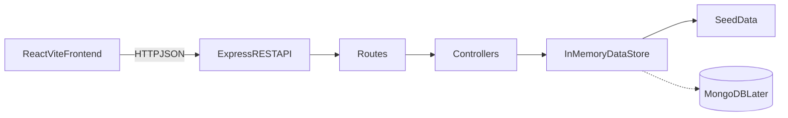
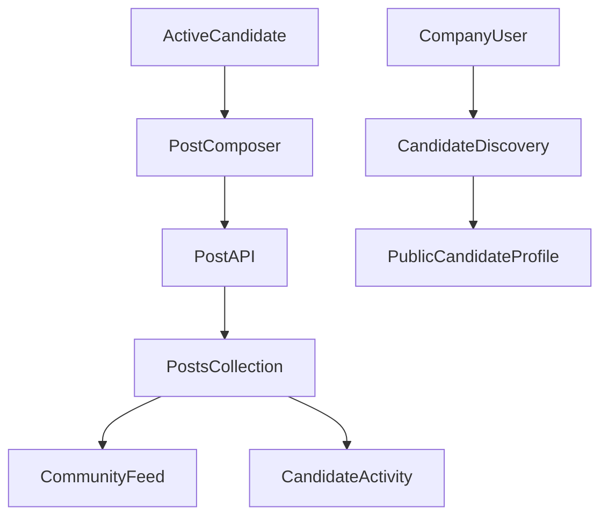

# ReverseHire Architecture

## Overview

ReverseHire is a small full-stack reverse-recruitment application:



The current implementation intentionally runs without MongoDB. The Express server loads seeded records into memory when it starts. The REST contract is designed so MongoDB can be introduced later without rewriting the frontend.

## Repository structure

```text
ReverseHire/
├─ backend/
│  ├─ controllers/       Request handling and business rules
│  ├─ data/              Seed records
│  ├─ middleware/        Async and error middleware
│  ├─ routes/            REST endpoint definitions
│  ├─ seed/              Repeatable in-memory seed command
│  ├─ store/             Current persistence abstraction
│  ├─ utils/             Validation and normalization
│  └─ server.js          Express application entry point
├─ frontend/
│  └─ src/
│     ├─ components/     Reusable UI pieces
│     ├─ context/        Demo identity state
│     ├─ hooks/          Shared React hooks
│     ├─ pages/          Route-level screens
│     ├─ services/       API client
│     └─ styles/         Design tokens and global styles
├─ docs/                 Project documentation
└─ README.md
```

## Frontend architecture

The frontend is a Vite React single-page application.

- `App.jsx` defines routes with React Router.
- `Layout.jsx` provides the shared navbar and footer.
- `DemoContext` stores the active demo role and selected candidate/company ID.
- `services/api.js` is the only layer that makes API requests.
- `useFetch.js` handles loading, errors, data, and reloads.
- Pages compose reusable components such as profile cards, opportunity cards, post cards, forms, and feedback states.
- CSS variables in `styles/tokens.css` define the visual system.

### Role-specific navigation

Candidates see:

- Dashboard
- Community
- My profile
- Inbox

Companies see:

- Discover candidates
- Dashboard
- Send opportunity
- Sent opportunities

There is no authentication yet. The `Demo as` switcher uses `localStorage` only for the active demo context:

```text
reversehire-role
reversehire-candidate
reversehire-company
```

This is suitable for demonstration, not production authorization.

## Backend architecture

The backend follows a routes/controllers/store separation:

1. Express receives the request.
2. A route maps the URL and HTTP method to a controller.
3. The controller validates input, applies business rules, and calls the store.
4. The store returns cloned records.
5. The controller sends a consistent JSON response.

The API response format is:

```json
{
  "success": true,
  "data": {}
}
```

Errors use:

```json
{
  "success": false,
  "message": "Please fix the highlighted fields",
  "errors": []
}
```

Global middleware handles JSON parsing, CORS, missing routes, and unexpected errors.

## Current persistence lifecycle

```text
Server starts
  ↓
DataStore.reset()
  ↓
Seed candidates, companies, opportunities, and posts
  ↓
API reads and mutates in-memory arrays
  ↓
Server restarts
  ↓
All runtime mutations are discarded
```

The browser never stores application records. It only stores the selected demo identity.

## Social architecture

Candidates share posts of type `TEXT`, `PROJECT`, or `VIDEO`. Posts contain embedded comments and reactions to keep the MVP small.



Video and image content is URL-based. No upload service or file storage is included.

## Future MongoDB architecture

When MongoDB is added, controllers should retain their current response shapes. The main replacement is the persistence layer:

```text
Current:
Controller → DataStore arrays

Future:
Controller → Repository → Mongoose model → MongoDB
```

Because Mongoose calls are asynchronous, controllers will need to use `async`/`await`. The frontend API client should not need to change.

