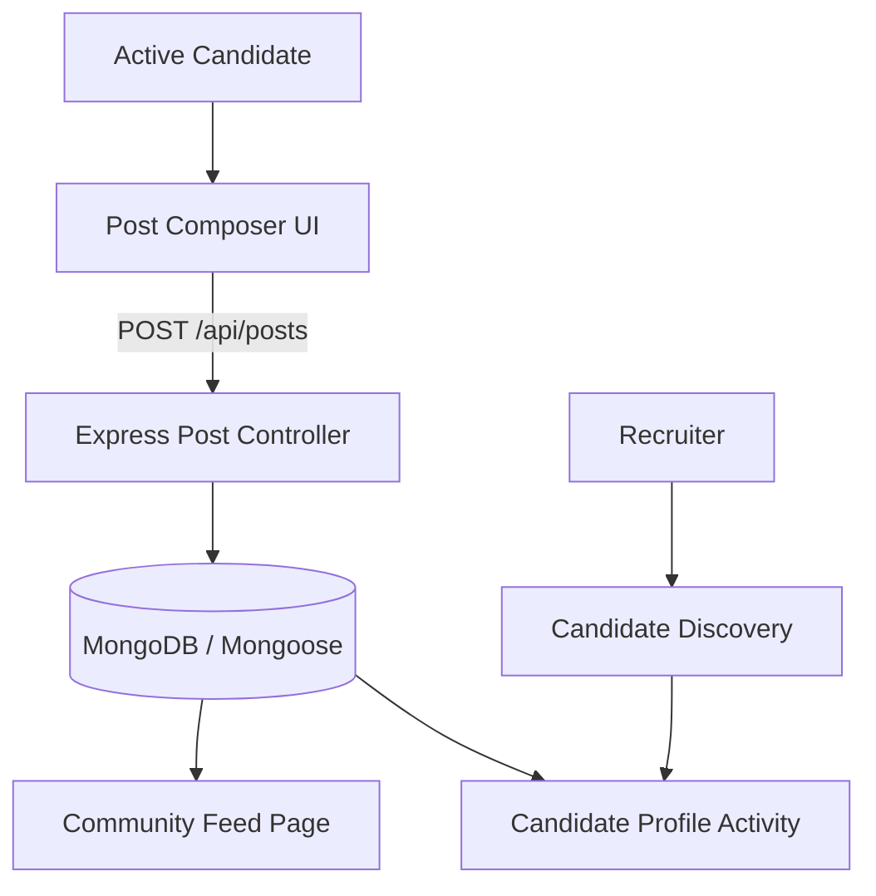

# Candidate Social & Community Features

## 1. Feature Purpose

In ReverseHire, the social layer empowers candidates to showcase not just static resumes, but ongoing projects, progress, and technical insights. Candidates build credibility through continuous updates, making them directly discoverable by hiring companies.

---

## 2. Product Scope & Access Control

- **Candidates**:
  - Publish posts (`TEXT`, `PROJECT`, or `VIDEO`).
  - Add comments to any post in the community.
  - React to posts (`LIKE`, `CELEBRATE`, `INSIGHTFUL`).
  - Edit and delete their own published posts and comments.
  - View personal activity history in the profile "Activity" tab.
- **Companies**:
  - View candidate profiles and public community activity.
  - Social posting and commenting are candidate-exclusive in this placement MVP to keep recruiter interactions focused on direct job outreach.

---

## 3. Post Types & Data Structure

Posts are modeled via `backend/models/Post.js` and support three distinct formats:

1. **Text Updates (`TEXT`)**: General lessons, engineering thoughts, or career updates.
2. **Project Showcases (`PROJECT`)**: Highlights project title, status (`CURRENT`, `UPCOMING`, `COMPLETED`), tech stack, and project URL.
3. **Video Walkthroughs (`VIDEO`)**: Embeds walkthroughs and demo links (YouTube/Vimeo/Loom URLs).

---

## 4. Comments & Reaction Lifecycle

### Comments
- Embedded directly within the post document (`post.comments`).
- Each comment records `id`, `authorId`, `body`, and `createdAt`.
- Only the author of a comment can delete it.

### Reactions
- Handled via `PATCH /api/posts/:id/reactions`.
- Supported reaction types: `LIKE`, `CELEBRATE`, and `INSIGHTFUL`.
- **Toggle Mechanism**:
  - Selecting a reaction for the first time adds `{ candidateId, type }`.
  - Selecting a different reaction updates the candidate's existing reaction type.
  - Selecting the same reaction removes it (toggle off).
- Dynamic hydration computes total `reactionCount`, `commentCount`, and `viewerReaction` for the active browsing candidate.

---

## 5. Candidate Activity & Portfolio Integration

The Candidate Profile page (`/candidates/:id`) features an **Activity** tab:
- Queries the community feed filtered by `authorId`.
- Highlights featured project posts specified in `candidate.featuredPostIds`.
- Demonstrates active domain engagement to prospective employers viewing the candidate's profile.
